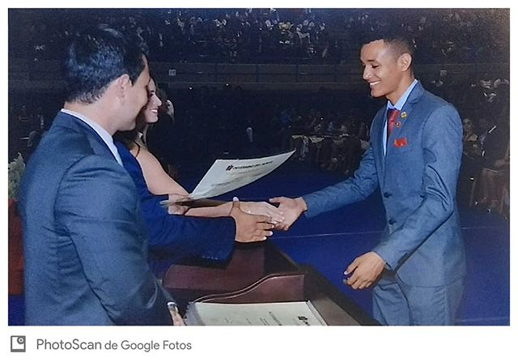
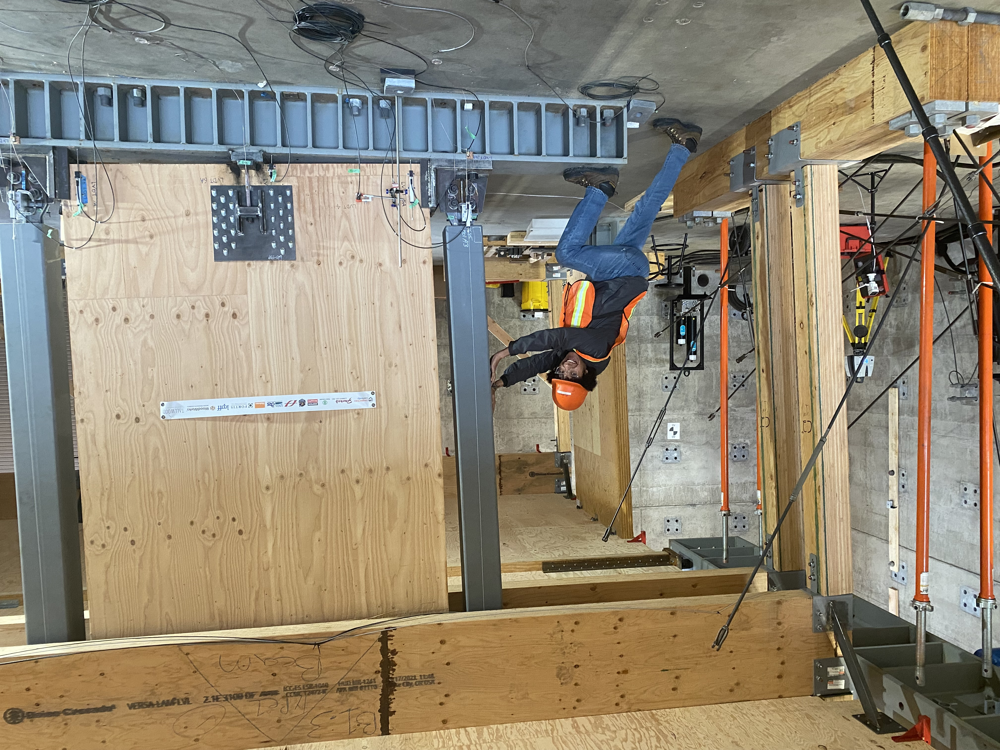
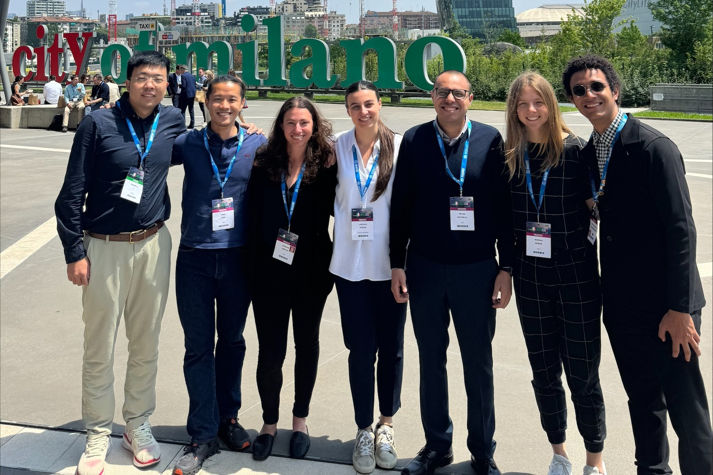
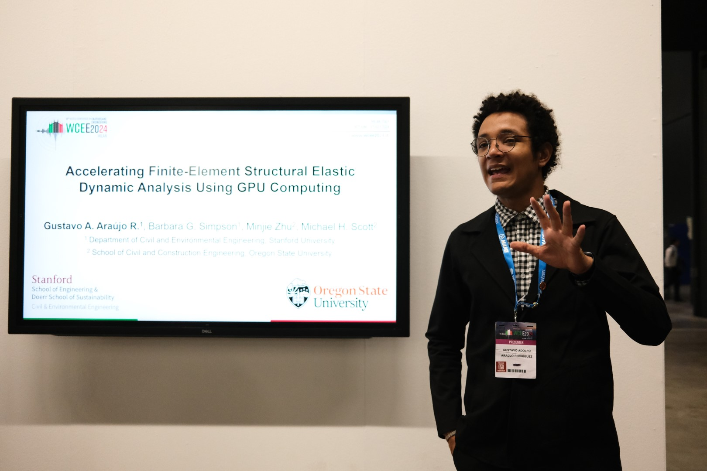
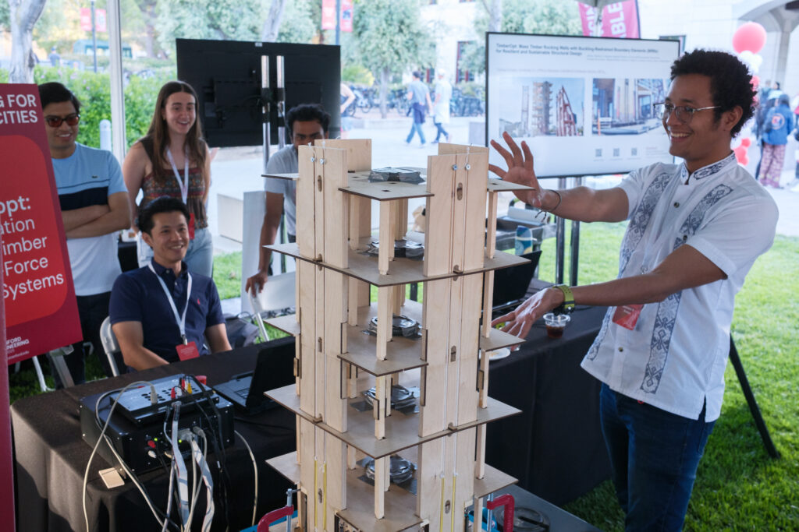
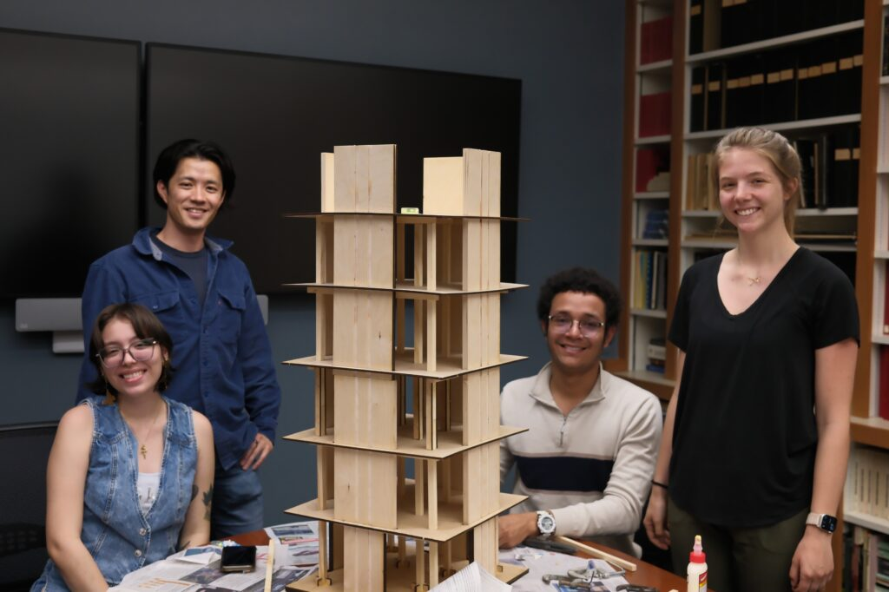
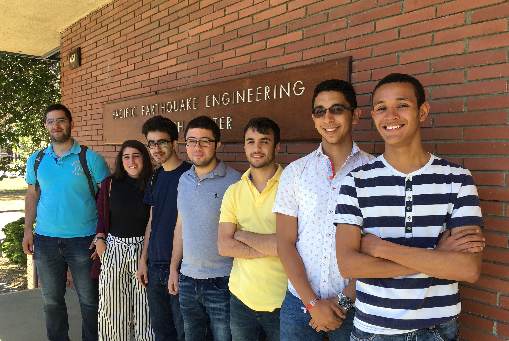
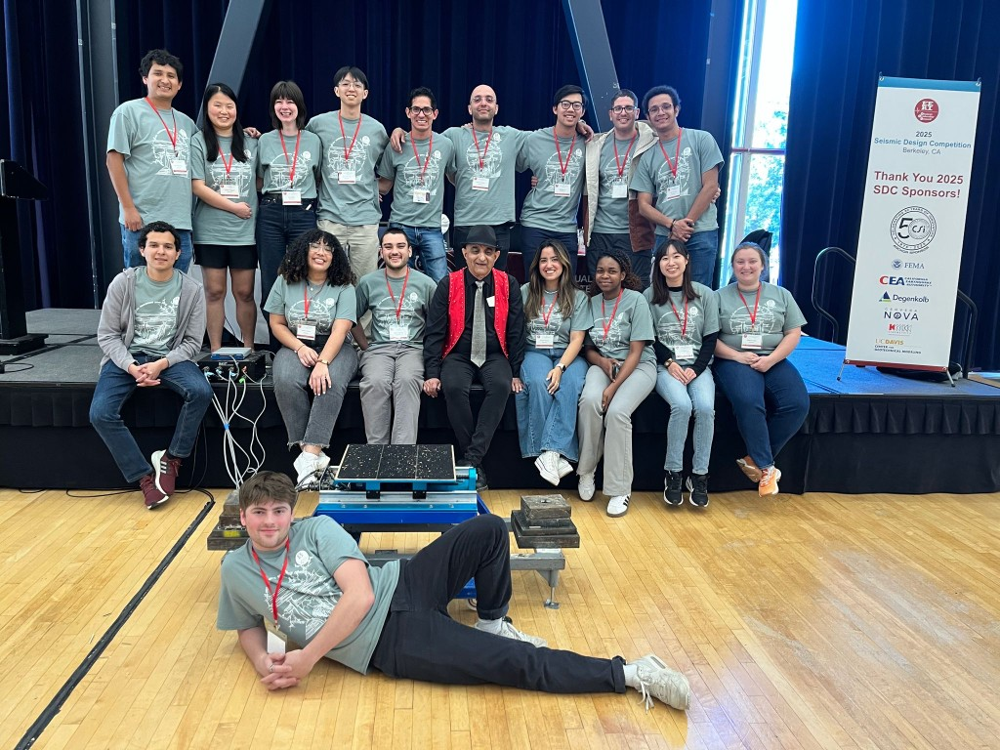
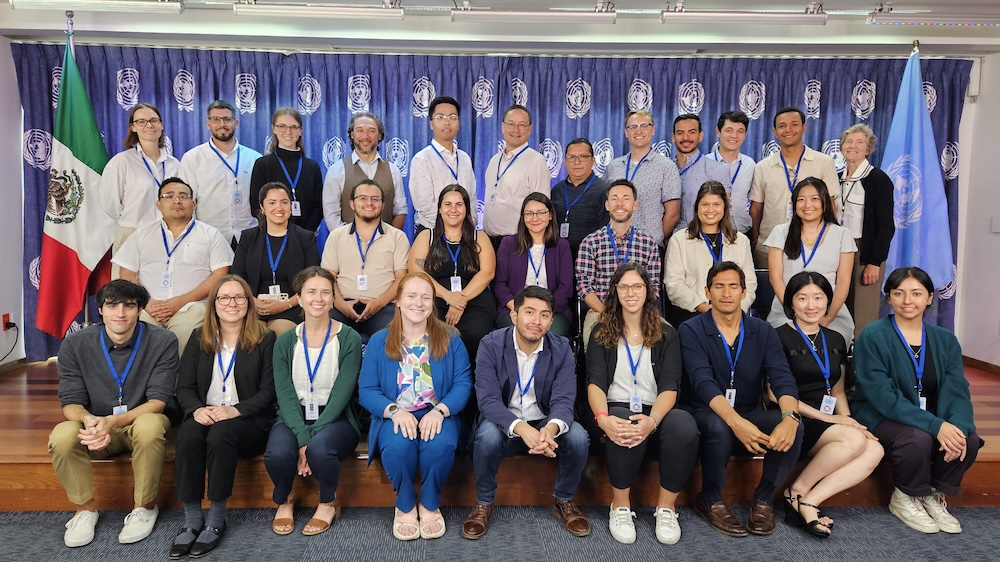
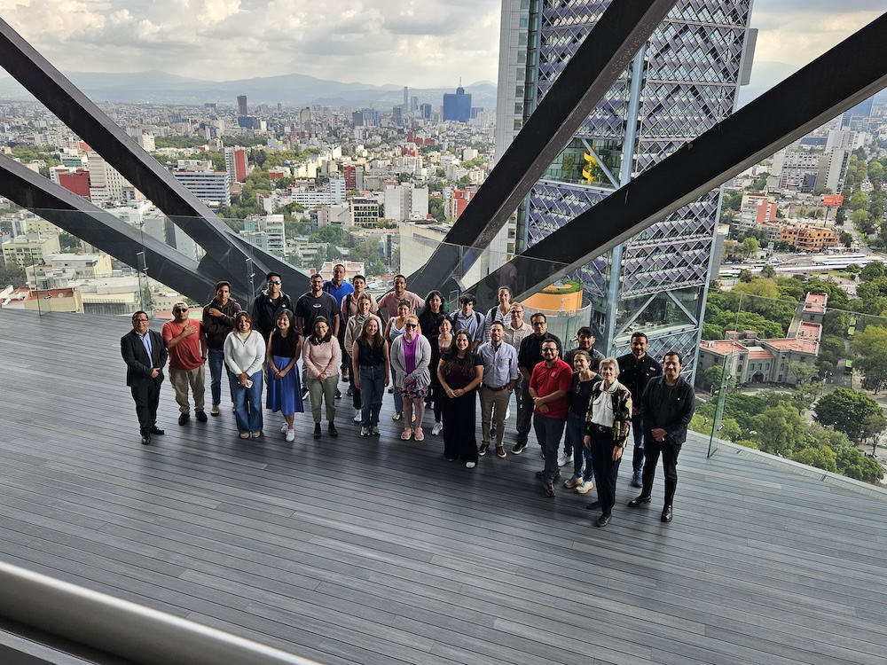

::: {.about-header}

::: {.about-photo}
{.profile-photo width="280" fig-alt="Gustavo A. Araújo R."}
:::

::: {.about-intro}
**Gustavo A. Araújo R.** is a PhD candidate in Civil and Environmental Engineering at [Stanford University](https://profiles.stanford.edu/gustavo-a-araujo) (expected December 2026), where he works at the [John A. Blume Earthquake Engineering Center](https://blume.stanford.edu/). His research combines experimental testing, nonlinear finite-element modeling, and GPU-accelerated simulation to study reinforced concrete and low-damage mass timber–steel structural systems under earthquake loading.
:::

:::

## Background

I received BS and MS degrees in Civil Engineering from [Universidad del Norte](https://www.uninorte.edu.co/) in Barranquilla, Colombia, where I worked with Prof. [Carlos A. Arteta](https://www.linkedin.com/in/carlos-a-arteta-43aa3586/) on reinforced concrete shear wall buildings, thin lightly reinforced concrete walls, and masonry-infilled moment-resisting frames.

::: {.content-photo}
{fig-alt="Gustavo A. Araújo R. receiving his BS in Civil Engineering diploma at Universidad del Norte, 2018" width="520"}

BS graduation, Universidad del Norte, Barranquilla, 2018.
:::

In 2020 I moved to the United States for an MS in Wood Science at [Oregon State University](https://oregonstate.edu/). At OSU I worked with Profs. [Barbara G. Simpson](https://www.linkedin.com/in/barbara-simpson-9255445b/), [Andre R. Barbosa](https://www.linkedin.com/in/andr%C3%A9-r-barbosa-452a6b/), and [Arijit Sinha](https://www.linkedin.com/in/arijit-sinha-99058827/) on the design, experimental testing, and numerical modeling of a three-story mass timber building with pivoting walls and buckling-restrained energy dissipators, in collaboration with the [TallWood Design Institute](https://tallwoodinstitute.org/). See the [OSU three-story test project](/projects/osu-three-story-pivoting-walls/index.qmd) for testing videos.

::: {.content-photo}
{fig-alt="Gustavo A. Araújo at the Oregon State University structural laboratory during three-story mass timber testing" width="520"}

At the OSU structural laboratory during three-story mass timber testing, November 2022 (TallWood Design Institute).
:::

At Stanford, my doctoral research includes NSF-funded work on GPU-accelerated nonlinear analysis and participation in the [NHERI Converging Design](https://tallwoodinstitute.org/converging-design-partners/) project, including Phase II shake-table testing of a six-story mass timber building at UC San Diego in January 2024. See the [six-story shake-table project](/projects/nheri-converging-design-six-story/index.qmd) for recordings from the test.

::: {.content-photo-pair}
{fig-alt="NHERI Converging Design team members at the UC San Diego shake-table facility during Phase II testing" width="520"}

{fig-alt="Investigators on site during the final days of six-story mass timber shake-table testing at UC San Diego" width="520"}

Team members on site during the final days of Phase II shake-table testing, UC San Diego, January 2024 (NHERI Converging Design).
:::

In July 2024 I attended the [18th World Conference on Earthquake Engineering (18WCEE)](https://www.wcee2024.it/) in Milan, Italy, with the [Simpson Lab](https://simpsoba.su.domains/). I presented *Accelerating Finite-Element Structural Elastic Dynamic Analysis Using GPU Computing* ([lab recap](https://simpsoba.su.domains/lab-update/wcee2024-in-milan-italy/)).

::: {.content-photo-pair}
{fig-alt="Simpson Lab group at the 18th World Conference on Earthquake Engineering in Milan, Italy" width="520"}

{fig-alt="Gustavo A. Araújo R. at the 18th World Conference on Earthquake Engineering in Milan, Italy" width="520"}

18WCEE, Milan, Italy, July 2024 — Simpson Lab group and at the conference (photos courtesy of [Simpson Lab](https://simpsoba.su.domains/)).
:::

In May 2025 I participated in the [Stanford Engineering Centennial Showcase](https://events.stanford.edu/event/stanford-engineering-centennial-celebration-and-showcase) with the [Simpson Lab](https://simpsoba.su.domains/), presenting a scaled shaking-table demo of mass timber rocking walls with BRBs and outreach on [NHERI Converging Design](https://tallwoodinstitute.org/nheri-converging-design/) testing ([lab recap](https://simpsoba.su.domains/lab-update/showcasing-innovation-in-resilient-structural-design-at-the-stanford-engineering-centennial/)).

::: {.content-photo-pair}
{fig-alt="Gustavo A. Araújo R. presenting a scaled mass timber rocking-wall model at the Stanford Engineering Centennial Showcase" width="520"}

{fig-alt="Simpson Lab team with the shake-table model built for the Centennial Showcase demo" width="520"}

Stanford Engineering Centennial Showcase, May 15, 2025 — outdoor demo and Simpson Lab team with the model (photos courtesy of [Simpson Lab](https://simpsoba.su.domains/)).
:::

Before graduate school, I completed a [PEER](https://peer.berkeley.edu/) summer internship at UC Berkeley (2017), working on nonlinear modeling of reinforced concrete wall buildings with OpenSees under Prof. Jack P. Moehle, and worked as an engineering intern at [Ingenia Structural](https://www.linkedin.com/company/ingenia-structural/) in Colombia.

::: {.content-photo}
{fig-alt="2017 PEER summer interns at the Pacific Earthquake Engineering Research Center, UC Berkeley" width="520"}

PEER summer interns, 2017 — Pacific Earthquake Engineering Research Center, UC Berkeley.
:::

## Current interests

- Nonlinear finite-element analysis
- GPU-accelerated computing
- Earthquake engineering and seismic risk
- Mass timber and low-damage structural systems
- Reinforced concrete

## Teaching

- **Winter 2025** — Teaching Assistant, CEE 282: Nonlinear Structural Analysis, Stanford University
- **2018–2019** — Graduate Teaching Assistant, Statics, Universidad del Norte
- **2014–2017** — Undergraduate Peer Tutor, Universidad del Norte (Statics, Mechanics of Materials, Differential Equations, Soil Mechanics, Structural Analysis)

## Service & leadership

Since 2022 I have been an active member of the [Earthquake Engineering Research Institute (EERI) Student Leadership Council](https://www.eeri.org/). I served as [Seismic Design Competition (SDC) Chair (2022–2023)](https://slc.eeri.org/slc-2022-2023-officers/), [Lead SDC Chair (2023–2024)](https://slc.eeri.org/slc-2023-2024-officers/), and [Co-President (2024–2025)](https://slc.eeri.org/2024-2025-slc-officers/). I also delivered an online OpenSees workshop in Spanish through Universidad del Norte and participated in the [2025 EERI Learning From Earthquakes Travel Study](https://www.eeri.org/about-eeri/news/27694-lfe-travel-study-explores-mexico-s-40-year-journey-toward-earthquake-resilience) in Mexico City.

::: {.content-photo}
{fig-alt="2025 EERI Seismic Design Competition participants and team members at Berkeley, California" width="520"}

2025 EERI Seismic Design Competition, Berkeley, CA.
:::

::: {.content-photo-pair}
{fig-alt="2025 EERI Learning From Earthquakes travel study participants at the United Nations office in Mexico City" width="520"}

{fig-alt="2025 EERI Learning From Earthquakes travel study group at Torre Reforma, Mexico City" width="520"}

2025 EERI Learning From Earthquakes Travel Study — United Nations office (above) and Torre Reforma (below), Mexico City. Photos courtesy of [EERI](https://www.eeri.org/).
:::

## Education

| Degree | Institution | Field | Year |
|--------|-------------|-------|------|
| PhD (in progress) | Stanford University | Civil & Environmental Engineering | Expected Dec 2026 |
| MS | Oregon State University | Wood Science | 2023 |
| MS | Universidad del Norte | Civil Engineering (Structures) | 2021 |
| BS | Universidad del Norte | Civil Engineering | 2018 |

## Honors & awards

- Shah Fellowship on Catastrophic Risk, Stanford University (2025–2026)
- [EERI Learning From Earthquakes Travel Study](https://www.eeri.org/about-eeri/news/27694-lfe-travel-study-explores-mexico-s-40-year-journey-toward-earthquake-resilience) Participant, Mexico City (2025)
- PEER Lightning Talks Contest — Runner-up, UC Berkeley (2023)
- PEER Pitches Contest — Winner, UC Berkeley (2022)
- Cum Laude Distinction (MS Thesis), Universidad del Norte (2021)
- Tallwood Design Institute Fellowship, Oregon State University (2020–2022)
- Provost's Distinguished Graduate Scholarship, Oregon State University (2020)
- Diploma for Graduate of Excellence, Universidad del Norte (2018)

## Media & profiles

```{=html}
<div class="media-grid">
  <article class="media-card">
    <a href="https://youtu.be/iHbXxmlKJ8M?si=stAesPyl-I4EvPQ8" class="media-thumb">
      
    </a>
    <div class="media-body">
      <p class="media-title"><a href="https://youtu.be/iHbXxmlKJ8M?si=stAesPyl-I4EvPQ8">Universidad del Norte video profile</a></p>
      <p class="media-desc">Spanish-language report about moving to Oregon State University to continue graduate studies.</p>
    </div>
  </article>
  <article class="media-card">
    <a href="https://www.uninorte.edu.co/web/blog.egresados/egresados-destacados-entradas/-/blogs/gustavo-araujo-es-admitido-en-la-universidad-de-stanford-para-culminar-sus-estudios-doctorales" class="media-thumb">
      
    </a>
    <div class="media-body">
      <p class="media-title"><a href="https://www.uninorte.edu.co/web/blog.egresados/egresados-destacados-entradas/-/blogs/gustavo-araujo-es-admitido-en-la-universidad-de-stanford-para-culminar-sus-estudios-doctorales">Universidad del Norte alumni profile</a></p>
      <p class="media-desc">Spanish-language article about being admitted to Stanford to complete doctoral studies.</p>
    </div>
  </article>
</div>
```

## Site notes

This website is built with [Quarto](https://quarto.org/) and hosted with [GitHub Pages](https://pages.github.com/).

Some posts on this website are drafted or edited with assistance from AI tools. I review and revise the material before publication, but any errors, omissions, or opinions are my own.

This is a personal website. The views expressed here are my own and do not necessarily represent Stanford University, Oregon State University, Universidad del Norte, PEER, NHERI, EERI, OpenSees, OpenSeesPy, or any other institution, project, or organization with which I am or have been affiliated.

Unless explicitly stated otherwise, references to OpenSees, OpenSeesPy, or related software are made in the context of my own research, teaching, examples, and personal technical notes. This site is not an official OpenSees or OpenSeesPy website.

If you use or adapt text, figures, code, examples, or other material from this website, please provide proper attribution to me and include a link back to the original page.

Email, affiliation, and professional profiles are on the [Contact](contact.qmd) page.
