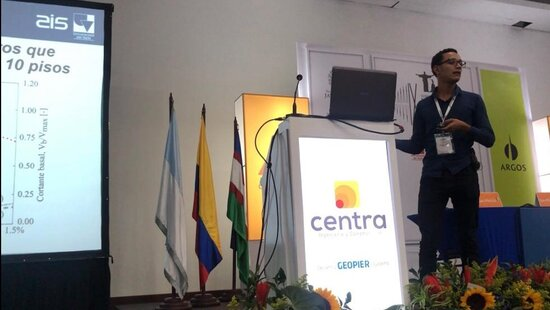
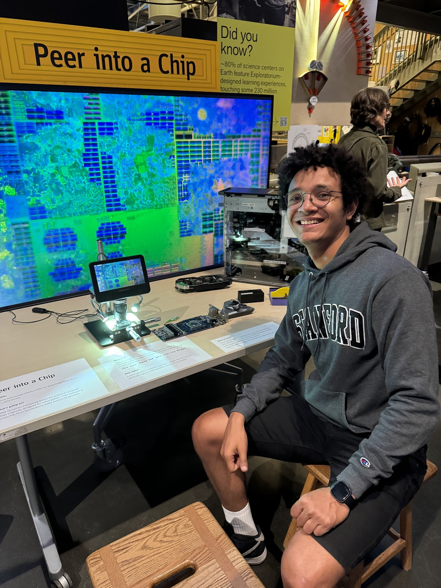

My research focuses on understanding structural behavior in traditional and novel systems through **experimental testing** and **numerical analysis** powered by high-performance computing. I work on two connected goals: developing **low-damage structural systems** for modern recovery objectives, and making **high-fidelity nonlinear modeling** a practical tool for performance-based design.

## Research themes

### Low-damage mass timber–steel systems

::: {.research-theme}
::: {.research-theme-body}
Experimental and numerical investigation of mass timber spine systems with steel buckling-restrained braces (BRBs). This includes a [three-story pivoting mass ply wall test at Oregon State University](/projects/osu-three-story-pivoting-walls/index.qmd) and [six-story post-tensioned rocking wall shake-table testing at UC San Diego](/projects/nheri-converging-design-six-story/index.qmd) as part of the NHERI Converging Design project. Key publication: cyclic testing and JSE article on the three-story building ([Araújo R. et al., 2025](https://doi.org/10.1061/JSENDH.STENG-13781)).
:::

::: {.research-theme-photo}
{fig-alt="Three-story mass timber test specimen at the Oregon State University structural laboratory" width="240"}

OSU structural laboratory, November 2022.
:::
:::

### Reinforced concrete walls and frame–wall structures

::: {.research-theme}
::: {.research-theme-body}
Development and validation of nonlinear models for thin, lightly reinforced concrete walls common in northern South America. Past work includes hybrid truss–fiber models for shear–flexure interaction ([Arteta et al., 2019](https://doi.org/10.1007/s10518-019-00681-6)), seismic risk assessment of TLRCW building typologies, and post-earthquake studies of mid-rise RC frame buildings ([Arteta et al., 2019](https://doi.org/10.1193/061218EQS144M)).
:::

::: {.research-theme-photo}
{fig-alt="Gustavo A. Araújo R. presenting MS thesis research on thin lightly reinforced concrete wall building systems" width="240"}

MS thesis presentation, Universidad del Norte ([press coverage](https://www.uninorte.edu.co/web/grupo-prensa/w/gustavo-araujo-recibe-distincion-cum-laude-por-estudio-que-eval%C3%BAa-el-riesgo-sismico-en-muros-delgados)).
:::
:::

### Nonlinear finite-element analysis & OpenSeesPy

::: {.research-theme}
::: {.research-theme-body}
Building reproducible analysis workflows for nonlinear static and dynamic simulation using OpenSees and OpenSeesPy. See [Examples](examples/index.qmd) for code-oriented notes and teaching materials, including an older [Spanish-language OpenSees workshop series](examples/opensees-spanish-workshops/index.qmd).
:::

::: {.research-theme-photo}
{fig-alt="Thumbnail for OpenSees workshop in Spanish, Taller 1" width="240"}

[OpenSees workshop in Spanish (Taller 1)](https://youtu.be/HJrfzjQyxrk) — see [workshop series](examples/opensees-spanish-workshops/index.qmd).
:::
:::

### GPU-accelerated computing

::: {.research-theme}
::: {.research-theme-body}
Adapting GPU-based methods to structural analysis to reduce computational cost of high-fidelity nonlinear simulations. This includes work presented at the [2024](talks/nheri-computational-symposium-2024/index.qmd) and [2026](talks/nheri-computational-symposium-2026/index.qmd) NHERI Computational Symposia on GPU-accelerated finite-element analysis.
:::

::: {.research-theme-photo}
{fig-alt="GPU chip under a microscope at the Exploratorium Peer into a Chip exhibit, San Francisco" width="240"}

Exploratorium, San Francisco — GPU computing (active research).
:::
:::

### Seismic hazard, fragility & risk

::: {.research-theme}
::: {.research-theme-body}
Probabilistic assessment of building performance, fragility functions, and risk metrics for RC and timber systems in high-seismicity regions—including post-earthquake reconnaissance in Colombia and the [2025 EERI Learning From Earthquakes Travel Study](https://www.eeri.org/about-eeri/news/27694-lfe-travel-study-explores-mexico-s-40-year-journey-toward-earthquake-resilience) in Mexico City.
:::

::: {.research-theme-photo}
{fig-alt="2025 EERI Learning From Earthquakes travel study group at Torre Reforma, Mexico City" width="240"}

EERI LFE Travel Study, Mexico City, 2025.
:::
:::

## Tools & methods

| Tool / Method | Application |
|---------------|-------------|
| OpenSees / OpenSeesPy | Nonlinear pushover, cyclic, and dynamic analysis |
| CUDA / GPU computing | Sparse linear solvers, parallel assembly |
| Python / NumPy / SciPy | Pre/post-processing, optimization, ML workflows |
| Fragility & risk analysis | Performance-based earthquake engineering |

## Collaborations

I have collaborated with researchers at Stanford, Oregon State University, Universidad del Norte, UC Berkeley (PEER), UC San Diego (NHERI), University College London, Simpson Strong-Tie, and NIST, among others. A full publication list is on the [Publications](publications.qmd) page.

## Ongoing projects

Browse [Projects](projects/index.qmd) for descriptions of current and completed work, including GPU-accelerated OpenSees extensions, the OSU three-story pivoting wall test, and the NHERI Converging Design six-story shake-table experiment.

## Get involved

If you are interested in collaboration, code review, or discussing OpenSees/GPU workflows, feel free to [contact me](contact.qmd).
